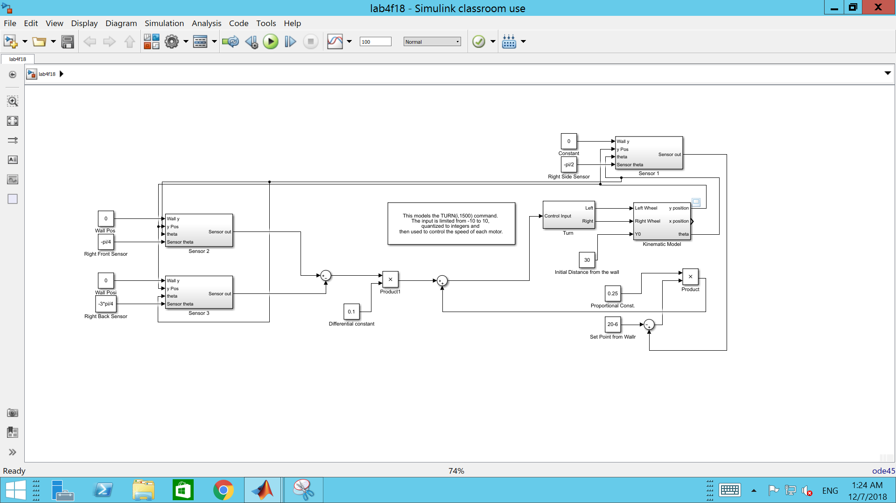

# Robotics

## Requirements

We were provided with a Robot with an Aurdino Teensy LC board. The robot had four IR sensors. The project was intended to monitor
the robot behaviour first. Next, a program needed to be developed to ensure robot goes in a straight line while avoiding any obstacle in 
front. The robot was required to return to initial positon every time it avoided the onstacle.  


Second part of the project involved using a kinematic model of the robot on MatLab Simulink. The PID controller based model was run with
propotional constants and initial distances. The same had to be programmed for the robot and see if the behavior of the model matched the 
behavior of the robot.



---
## Files

The files uploaded here, include Libraries, Robotspi, LIDARtest, ObstructionAvoid, and Kinematic. The libraries have all the reuiqred 
files for the robot operation. The remaining programs were written down to to observe the various behaviors of the robot. 

---

## Approach

First, a program was written to study the various behaviors of the robot. The different ways the robot could move was understood.
```C
#include <SPI.h>
#include <robotlib.h>
robotlib Robot;

VL53L0X FRsensor;
VL53L0X FSsensor;
VL53L0X SIsensor;
VL53L0X BSsensor;

void setup() {


Robot.initial();  // This initiallizes the PIC microcontrollers and the Sensors
Serial.begin(9600); // sends data out on the USB

}

void loop() {

int mspeed = 2000; //This is the time in microseconds between steps

// Make the robot go straight
Robot.LCDclear();
Robot.LCDstring("Foward ");
for(int j = 0; j<255;j++)
Robot.forward(mspeed);

// Make the robot go backward
Robot.LCDclear();
Robot.LCDstring("Backward ");
for(int j = 0; j<255;j++)
Robot.backward(mspeed);

// Rotate robot on its axis to the left by moving right wheel forward and left wheel backward by same amount
Robot.LCDclear();
Robot.LCDstring("Left1 ");
for(int j = 0; j<255;j++)
Robot.left1(mspeed);

// Rotate robot on its axis to the right by moving left wheel forward and right wheel backward by same amount
Robot.LCDclear();
Robot.LCDstring("Right1 ");
for(int j = 0; j<255;j++)
Robot.right1(mspeed);

// Rotate robot to left using the right wheel forward and left wheel stationary
Robot.LCDclear();
Robot.LCDstring("Left2 ");
for(int j = 0; j<255;j++)
Robot.left2(mspeed);

// Rotate robot to right using the left wheel forward and right wheel stationary
Robot.LCDclear();
Robot.LCDstring("Right2 ");
for(int j = 0; j<255;j++)
Robot.right2(mspeed);


//This code is for the LCD Display
Robot.LCDclear();   //Clears the LCD display


Robot.LCDchar("This is the end ", 16);  //Writes the string, needs the length

delay(500);
int aa = 27;


Robot.LCDnum(aa); // This writes an integer (no length required

Robot.LCDstring("   ");
Robot.LCDstring("Maybe not");  // This writes a string no length required.
delay(500);

}
```

Next, the sensors on the robots had to be tested for proper  functioning. This was done using the program below,

```C
/*This code is to test the use of the LIDAR sensors, the VL53L0X

I2C communicates with each of the units*/

#include <string.h>
#include <SPI.h>
#include <robotlib.h>
robotlib Robot;
#include <Wire.h>

// VL53L0X needed stuff
#include <VL53L0X.h>
VL53L0X FRsensor;
VL53L0X FSsensor;
VL53L0X SIsensor;
VL53L0X BSsensor;

void setup() {
  // put your setup code here, to run once:
  Robot.initial();
  delay(100);
}
float a;
void loop() {
  // put your main code here, to run repeatedly:
  //Read and print the VL53L0x to the LCD and the Serial Monitor
  
  Robot.LCDclear();
  delay(10);
  
  a = Robot.readsensor("FR"); // FRont sensor
  Serial.print(a);
  Serial.print("   ");
  Robot.LCDnum(a);
  Robot.LCDstring(",  ");
  
  a = Robot.readsensor("FS"); // FrontSide sensor
  Serial.print(a);
  Serial.print("   ");
  Robot.LCDnum(a);
  Robot.LCDstring(",  ");
  
  a = Robot.readsensor("SI"); // SIde sensor
  Serial.print(a);
  Serial.print("   ");
  Robot.LCDnum(a);
  Robot.LCDstring(",  ");
  
  a = Robot.readsensor("BS"); //BackSide sensor
  Serial.print(a);
  Serial.print("   ");
  Serial.println();
  Robot.LCDnum(a);
  Robot.LCDstring(",  ");
  
  Serial.println();
  delay(500);
  
}
```

To complete the first part of the project, where the robot had to avoid obstacles, a state machine approach was used. Different 
behaviors were recognised of the robot ad incorporated into different states. The program is as shown,

```C
#include <string.h>
#include <SPI.h>
#include <robotlib.h>
robotlib Robot;
#include <Wire.h>

// VL53L0X needed stuff
#include <VL53L0X.h>
VL53L0X FRsensor;
VL53L0X FSsensor;
VL53L0X SIsensor;
VL53L0X BSsensor;

void setup() {
  // put your setup code here, to run once:
  Robot.initial();
  delay(100);
} //end void setup

float a,b;
int state =1;
int x=0,y=0;
void loop() 
{ 

  // Main code to dictate the robot behaviour
 
  Robot.LCDclear();
  delay(10);
  int mspeed = 3500;             //This is the time in microseconds between steps

  while(state==1)
  // This state uses only the front sensor to see if obstacles are there
  {
    a = Robot.readsensor("FR");   // Variable that stores distance from FRont sensor
    if (a>5)                      //If clear of obstacle in the front
    {
      for(int j = 0; j<100;j++)   // Go forward for 100 steps
      Robot.forward(mspeed);
      Robot.LCDstring("Foward ");
      state=1;
    }
    else                          // when obstacle is too close
    {
      Robot.LCDclear();
      Robot.LCDstring("Left2");   // make a left to avoid front collision    
      for(int j = 0; j<185;j++)     
      Robot.left2(mspeed);

      for(int j = 0; j<100;j++)   // Go forward for 100 steps. Before changing the state
      Robot.forward(mspeed);
      
      x=x+1;                      // variable to ensure return to the initial position
      state=2;
    }
  }
  while(state==2)
  {
      
      
      a = Robot.readsensor("FR");   // sense front sensor
      b = Robot.readsensor("SI");   // sense side sensor

      if (a>5 && b<5)                 // if no obstacle in front and obstacle on right side
        {
          for(int j = 0; j<100;j++)   // Go forward for 100 steps. Cushion
          Robot.forward(mspeed);
          Robot.LCDstring("Foward ");

          a = Robot.readsensor("FR"); // check the front sensor again to see if behavior 3
          if (a>20 && b<5)
          {
            state = 3;                // if behavior 3, go to state 3
          }
          else
          {
          state =2;
          }
        }
       else if (a>5 && b>5)             // if robot is clear of obstacles from both front and side
        {
          for(int j = 0; j<100;j++)   
          Robot.forward(mspeed);       // Go forward for 100 steps. Cushion
          Robot.LCDstring("Foward ");

          Robot.LCDstring("Right2 ");
          for(int j = 0; j<170;j++)
          Robot.right2(mspeed);        // Turn right
          state = 3;
           
        }
      else if (a<5 && b<5)                // if obstacle in front and on side
        {
          Robot.LCDclear();
          Robot.LCDstring("Left2");     
          for(int j = 0; j<185;j++)     
          Robot.left2(mspeed);
          
          x=x+1;                      // increment x everytime we go away from initial line
          
          state =2;                      
        }
      else
      {
        state=1;
      }
  }

  while (state == 3)
    {
       for(int j = 0; j<100;j++)        //go forward for few steps 
       Robot.forward(mspeed);       
       Robot.LCDstring("Foward ");

       a = Robot.readsensor("FR");   // sense front sensor
       b = Robot.readsensor("SI");   // sense side sensor

       if ( a>20 && b>5)              // state 2 behavior
       {
        state = 2;
       }
       else if ( a>20 && b <5)
       {
          for(i=0;i=x;i--)            // to go back to initial position
          for(int j = 0; j<100;j++)        
          Robot.forward(mspeed);

          Robot.LCDclear();
          Robot.LCDstring("Left2");   //turn left to follow the first condition    
          for(int j = 0; j<185;j++)     
          Robot.left2(mspeed);

          state = 1;                  // go back to state 1
          
       }
       else
       {
        state = 2;
       }
       
    }
Serial.println();
delay(500);
Robot.LCDchar("This is the end ", 16);  //Writes the string, needs the length

delay(500);
int aa = 27;


Robot.LCDnum(aa); // This writes an integer (no length required

Robot.LCDstring("   ");
Robot.LCDstring("Maybe not");  // This writes a string no length required.
delay(500);
}
```

For the second part of the project, to test the robots behaviour against the kinematic model, the mathametical equation was put in
to realise the PID controller with same proportional and differential constants as the Simulink model.

```C
#include <string.h>
#include <SPI.h>
#include <robotlib.h>
robotlib Robot;
#include <Wire.h>

// VL53L0X needed stuff
#include <VL53L0X.h>
VL53L0X FRsensor;
VL53L0X FSsensor;
VL53L0X SIsensor;
VL53L0X BSsensor;

void setup()           // Used to set-up the robot
{
    // put your setup code here, to run once:
    Robot.initial();
    delay(100);
  int mspeed = 2500;      //This is the time in microseconds between steps
}
void loop() {
  int mspeed = 2500;// put your main code here, to run repeatedly:
  while(true) // Starts a loop
  { 
  
        float a = Robot.readsensor("FS"); //Reads Front-side sensor
        float b = Robot.readsensor("BS"); //Reads Back sensor
        float c = Robot.readsensor("SI"); //Reads Side sensor
        float d = Robot.readsensor("FR"); //Reads Front sensor  
     
        if(d < 25)        //Check if any obstacle in front 
        {
            for(int i=0; i<50; i++)   //If any object in front, make the left slowly
            {
                Robot.left1(mspeed);  //Robot command to make the turn
            }
        }
          float prop = 0.3;       //Defines the propogation constant
          float diff = 0.1;       //Defines the differential constant

    //We have the equation that we simulated in the simulink model. 
    //We put in the equation into the robot and see if the behavior is same as simulink model   

          Robot.TURN(diff*(a - b) + (prop * (c - 20)), mspeed); // Initial distance from wall set to 20
          Robot.TURN(diff*(a - b) + (prop * (c - 20)), mspeed); 
  
  }
}
```
---

## Observation

The robot was successfully programmed to meet the requirements. The robot seemed to duplicate the behavior as done by the simulink 
model.  


